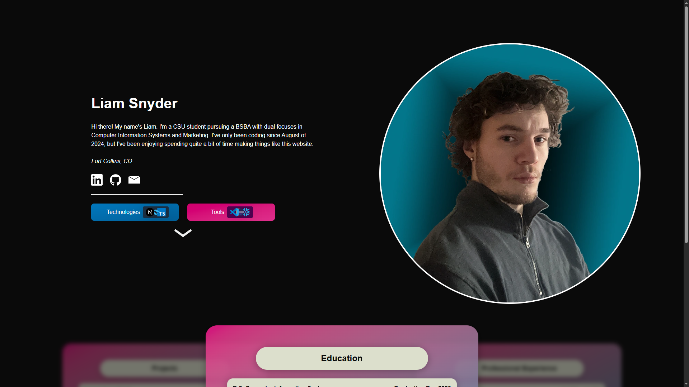

### Liam Snyder – Personal Website 

This is my personal website, built with [Next.js](https://nextjs.org/), [Tailwind CSS](https://tailwindcss.com/), and [TypeScript](https://www.typescriptlang.org/). I made it to act as my personal online hub for professional life while giving me full customization over what I'm able to do.

 

---

<a href = "https://liammacksnyder.com">

    

</a>

---

### 🌐 Live Site
> ### **[liammacksnyder.com](https://liammacksnyder.com)**

    

 

 ### 🛠️ Tech Stack
>- **[Next.js](https://nextjs.org/)** – Full-stack React framework for performant web app development
> - **[TypeScript](https://www.typescriptlang.org/)** – Type-safe JavaScript for safer, more maintainable code
> - **[Tailwind CSS](https://tailwindcss.com/)** – Utility-first styling framework for quick UI development
> - **[Vercel](https://vercel.com/)** – Cloud platform for deployment and hosting